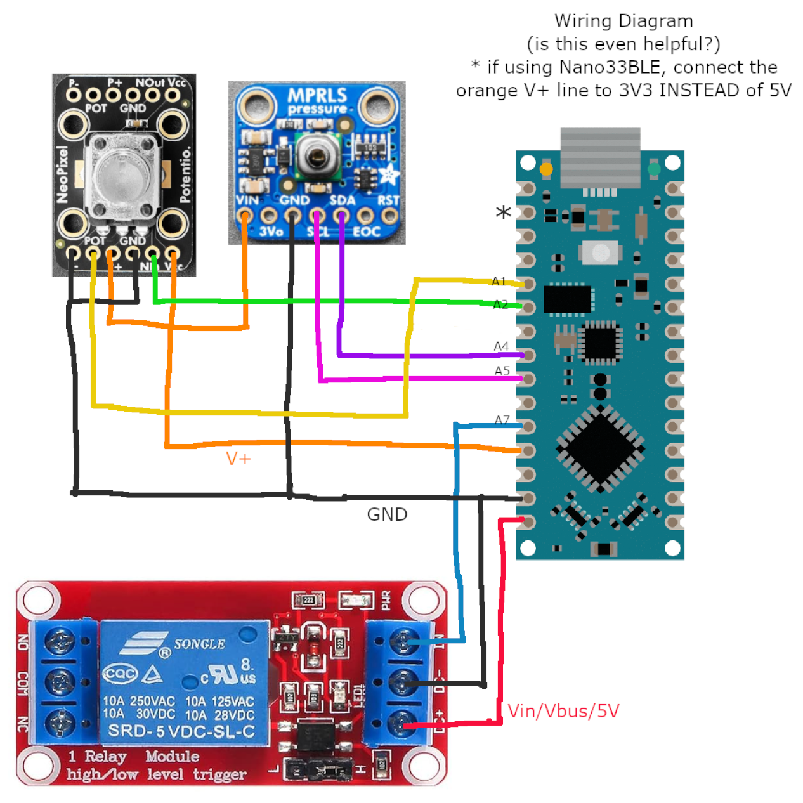

# AutoRegulator

AutoRegulator is an Arduino Nano or NanoBLE powered suction regulator for vacbeds.
A relay is actuated based on a sensor and threshold - that's pretty much it.
It's designed to be inexpensive and easy to source parts for. 

It's very DIY - you could use it with a vacuum cleaner with a check valve, or a diaphragm pump.
This project is just in charge of switching a relay.

## WIP: TODO:
- finish sourcing links
- upload schematic and hardware build guide (maybe do a pcb, it's not that many wires to solder though)
- organize my 500 line main into separate files

## Features

- Automatic calibration
- Settable suction level
- LED feedback

### NanoBLE only features

- Serial console with statistics
- coming soon? BLE functionality / [buttplug.io](https://github.com/buttplugio) integration (I have a separate working prototype, just have to integrate it)
- coming soon? pulsing/pattern playback functionality (may require additional hardware to control venting rate)

### Safety features

This device isn't intended to be used alone, it's not safe, ***DO NOT*** do it.
We can't make any claims about safety, even if you build and use the project as intended.
In the rare case that something goes wrong, like, a lightning strike, we've tried to include as many safety features as reasonable:
  - shuts down on power loss or reset, which disables suction
  - requires external input (turn dial all the way to the left) upon reboot before starting
  - automatic shutdown if sensor read fails
  - automatic shutdown after 1 hour

...but you should not rely on any of these. Ever. This isn't enterprise industrial control software, it's DIY hardware, and ultimately, it's up to the operator of the machine to decide how to use this!
(I'm not liable or responsible for the irresponsible use of this considerably irresponsible firmware written by idiots)

## Build Guide

### Electronics BOM with Sourcing (US)

 - Arduino Nano, or clone
 - Honeywell absolute pressure sensor breakout board
   - (preferred) Adafruit: https://www.adafruit.com/product/3965
   - (alternative) DigiKey: https://www.digikey.com/en/products/detail/adafruit-industries-llc/3965/9658071
   - (alternative, more expensive as shipping is bundled into price) Amazon: https://a.co/d/0icpQsJ6
 - Isolated relay module
   - (alternative) Amazon: https://a.co/d/0h9XaJEC
 - RGB Potentiometer
   - (preferred) Adafruit: https://www.adafruit.com/product/6387
   - (alternative) DigiKey: https://www.digikey.com/en/products/detail/adafruit-industries-llc/6387/27545875
   - If you'd like, you can use a plain linear rotary pot (10k ideally) and a single WS2812B-compatible LED
 - Solderable FR4 Protoboard - 70x90mm recommended
 - Female pin headers (optional, but makes swapping things out a lot easier while soldering)
 - 0.1uF ceramic capacitor (THT, optional)

You may need some other things, such as:
 - Electrical tape
 - Pliers, screws
 - Soldering iron w/ fine solder
 - Wire (I used solid core 18AWG)
 - A screwdriver
 - And importantly, a wiring solution for whatever you connect the relay to. May require lever nuts, ferrules, etc.

### 3D Printed Parts (SLA)

- Sensor to 3/16" tubing adapter (requires heatset inserts, and 2 2.5mmx8 SHCS screws) (todo:link)
- 3/16" tubing to PVC adapter (todo:link, other PVC size variants)
- 3/16" tubing break-out block

- You'll also need a case, but depending on where you mount the parts on the protoboard, it's going to be different.

### Assembly

- **NOTICE**: The Honeywell pressure sensor, and the breakout board by extension, is *extremely* fragile.
Even soldering the pin headers for too long can overexpose it to heat and cook it.
Giving it 5V on the 3Vo pin will instantly fry it.
Giving the regulator more than ~9V will instantly boil it.
SDA/SCL can accept at *most* whatever you give the regulator thanks to the level shifter.
Double check your wiring at every stage and before power on.

- Pinouts for supported boards

| Arduino Nano Pin | Arduino Nano33BLE Pin | Connect To           | 
|------------------|-----------------------|----------------------|
| A1               | A1                    | Potentiometer center | 
| A2               | A2                    | Neopixel Data In     |
| A4 (SDA)         | A4 (SDA)              | Sensor SDA           |
| A5 (SCL)         | A5 (SCL)              | Sensor SCL           |
| A7               | A7                    | Relay input          |
| 5V               | 3V3                   | Potentiometer V+     |
| 5V               | 3V3                   | Neopixel VCC         |
| 5V               | 3V3                   | Sensor Vin           |
| Vin/VBUS         | Vin/VBUS              | Relay DC+            |
| GND              | GND                   | Relay DC-            |
| GND              | GND                   | Sensor GND           |
| GND              | GND                   | Neopixel GND         |
| GND              | GND                   | Potentiometer V-     |

---

| Relay Pin | Connect To                    |
|-----------|-------------------------------|
| COM       | User defined, e.g, AC neutral |
| NO        | User defined, e.g, AC live    |
| NC        | Nothing                       |

---

